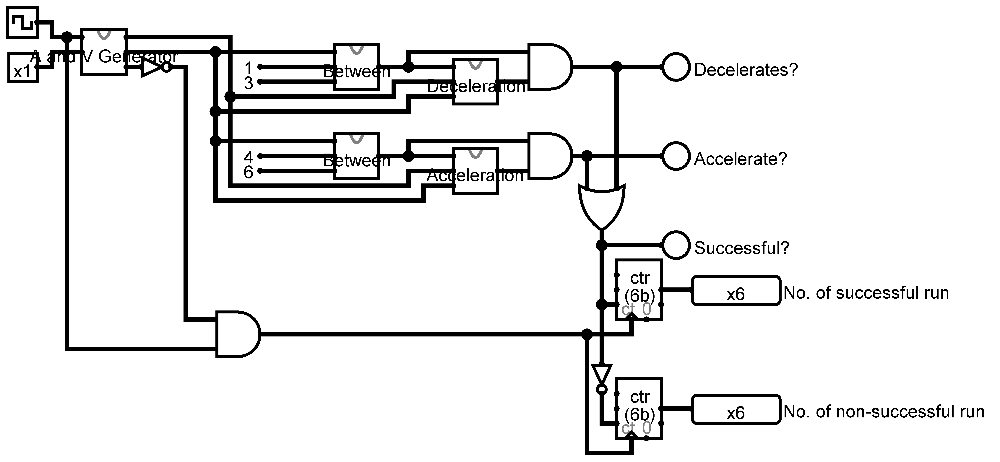
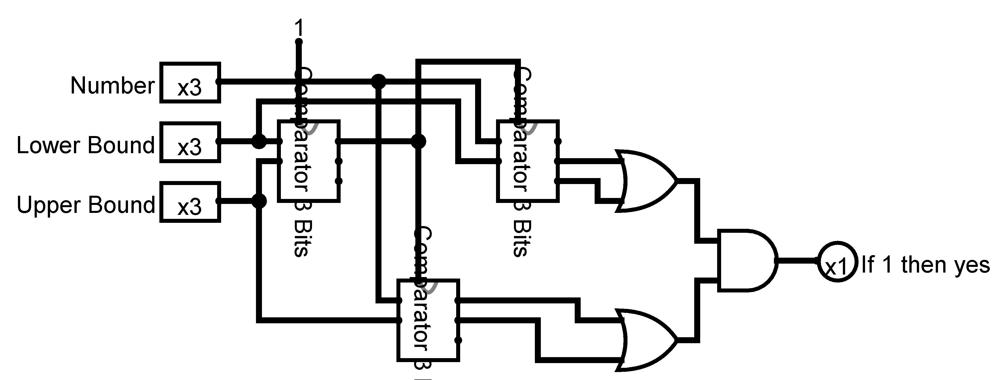
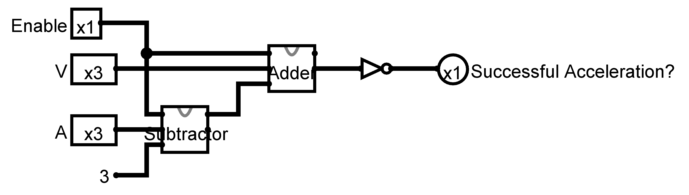
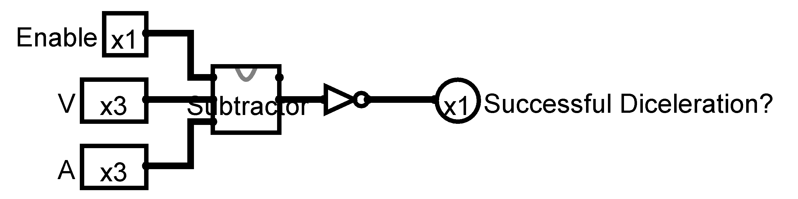

# Complex Solution

[Solution file](./circuit.circ)

This solution contains following circuits:

- [Main Circuit](#main-circuit)
- [Subcircuits](#subcircuits)
  - [3 Bits Or](#3-bits-or)
  - [Adder](#adder)
    - [1 Bit](#adder-1-bit)
    - [3 Bits](#adder-3-bits)
  - [Subtractor](#subtractor)
    - [1 Bit](#subtractor-1-bit)
    - [3 Bits](#subtractor-3-bits)
  - [Comparator](#comparator)
    - [1 Bit](#comparator-1-bit)
    - [3 Bits](#comparator-3-bits)
  - [Check Between](#between)
  - [A and V Generator](#a-and-v-generator)
  - [Acceleration](#accerleration)
  - [Deceleration](#deceleration)

## Main Circuit

## Subcircuits

### 3 Bits Or

### Adder

#### Adder 1 Bit

#### Adder 3 Bits

### Subtractor

#### Subtractor 1 Bit

#### Subtractor 3 Bits

### Comparator

#### Comparator 1 Bit

#### Comparator 3 Bits

### Check Between

This circuit checks whether the `Number` is between `Lower Bound` and `Upper Bound`.

### A and V Generator

### Acceleration

### Deceleration

> This solution is not an auto generated solution.
