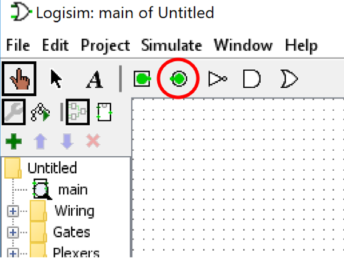
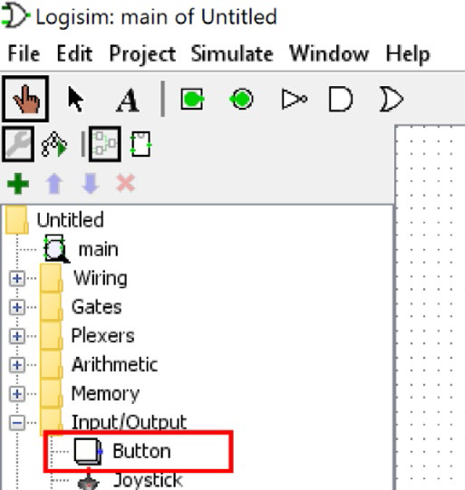
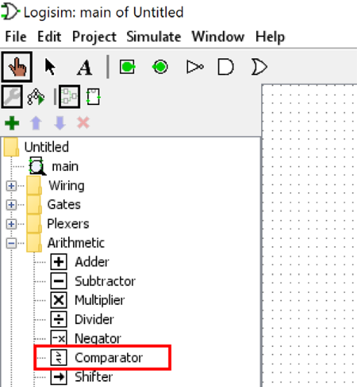
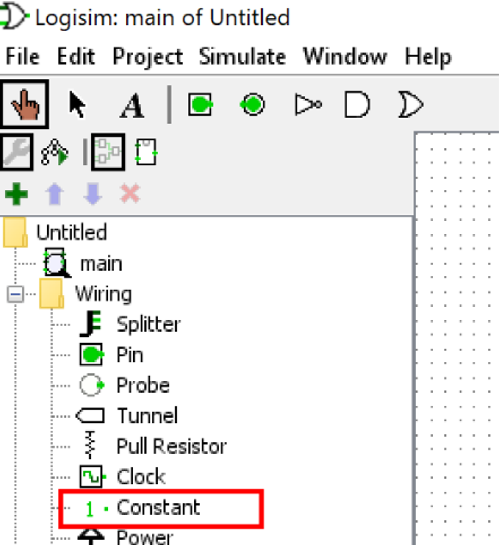
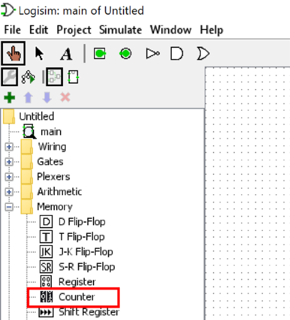
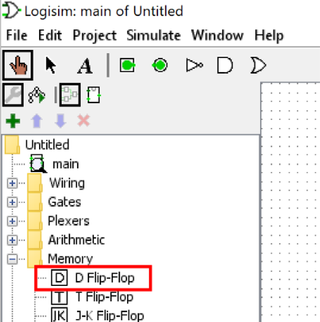
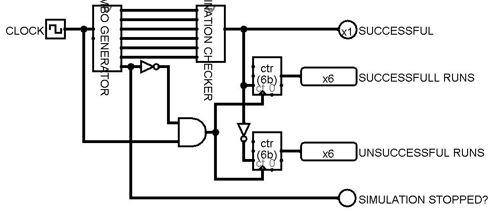

# Key Lock Combo

- [Problem Statement](#problem-statement)
  - [Requirements](#requirements)
  - [Examples](#examples)
  - [Representing K and L values](#representing-k-and-l-values)
  - [Part A](#part-a)
  - [Part B](#part-b)
    - [Part B Implementation Requirements](#part-b-implementation-requirements)
  - [Template/Subcircuit requirement](#templatesubcircuit-requirement)
- [Solution](#solution)
  - [Part A](#solution-part-a)
    - [Main Circuit](#main-circuit)
    - [Subcircuit - Key and Locker Generator](#subcircuit---key-and-locker-generator)
    - [Subcircuit - Checker](#subcircuit---checker)
    - [Truth Table](#truth-table)
    - [How does this circuit works?](#how-does-this-circuit-works)

## Problem Statement

### Requirements

For this assignment you must implement a simple simulation of a key and a lock. The simulation has two inputs. Input 1 (K) represents the current key to be used with values ranging from 0-7. Input 2 (L) represents the current lock with values ranging from 0-7. A key and lock combination (K, L) is considered successful if the key can open the lock. If the key cannot open the lock the combination is considered unsuccessful.

A K value of 0 represents the master key that will open all available locks (0-7).

```text
K=0 can open Lock 0, 1, 2, 3, 4, 5, 6, and 7
```

A K value of 1, 2, 3, 4, or 5 represents a normal key that can only open the lock with the same value as the key. It cannot open any other lock.

```text
K=1 can only open Lock 1
K=2 can only open Lock 2
K=3 can only open Lock 3
K=4 can only open Lock 4
K=5 can only open Lock 5
```

A K value of 6 represents a master key that can open locks 1, 2, 3, and 6. It cannot open locks 0, 4, 5, or 7.

A K value of 7 represents a master key that can open locks 4, 5, and 7. It cannot open locks 0, 1, 2, 3, and 6.

### Examples

1. K=0, L=3: Key 0 can open Lock 3. This combination is *successful*.
2. K=5, L=1: Key 5 cannot open Lock 1. This combination is *unsuccessful*.
3. K=5, L=5: Key 5 can open Lock 5. This combination is *successful*.
4. K=6, L=1: Key 6 can open Lock 1. This combination is *successful*.
5. K=6, L=4: Key 6 cannot open Lock 4. This combination is *unsuccessful*.
6. K=7, L=0: Key 7 cannot open Lock 0. This combination is *unsuccessful*.

> **Note:** The examples on this page represent only some selected cases. There are (many) more cases that result in successful or unsuccessful combinations. Your circuit must correctly show a successful or unsuccessful combination for each possible case.

### Representing K and L values

The Key (K) will be represented by three inputs (3 bits). The three K inputs are named as K1, K2, and K3. The table below shows the assignment of bits to each K value for K1, K2, and K3. Note the order of these bits, K1 is on the left.

The Lock (L) will be represented by three inputs (3 bits). The three L inputs are named as L1, L2, and L3. The table below shows the assignment of bits to each L value for L1, L2, and L3. Note the order of these bits, L1 is on the left.

| K Value | K1 | K2 | K3 | L Value | L1 | L2 | L3 |
|:-------:|:--:|:--:|:--:|:-------:|:--:|:--:|:--:|
|    0    |  0 |  0 |  0 |    0    |  0 |  0 |  0 |
|    1    |  0 |  0 |  1 |    1    |  0 |  0 |  1 |
|    2    |  0 |  1 |  0 |    2    |  0 |  1 |  0 |
|    3    |  0 |  1 |  1 |    3    |  0 |  1 |  1 |
|    4    |  1 |  0 |  0 |    4    |  1 |  0 |  0 |
|    5    |  1 |  0 |  1 |    5    |  1 |  0 |  1 |
|    6    |  1 |  1 |  0 |    6    |  1 |  1 |  0 |
|    7    |  1 |  1 |  1 |    7    |  1 |  1 |  1 |

### Part A

The implementation for this part must use only the three basic logic gates (AND, OR, NOT). Each AND gate and each OR gate can have only 2 inputs. More or less than 2 inputs for AND and OR gates is not permitted. Each NOT gate can have only 1 input. No other logic gates or circuits are permitted to be used in your circuit for Part A.

You are required to implement a circuit where the user (you) can input a value for the Key (K) using value (K1, K2, and K3) and Lock (L) using value (L1, L2, and L3) and the circuit decodes the K1, K2, K3 and L1, L2, and L3 values using a decoder made up of only the permitted logic gates. The output of the decoders is used to determine if the key and lock combination is successful or unsuccessful based on the rules outlined in the [requirements section](#requirements).

The output is via a single output pin (green circle in Logisim):


The output pin must be labelled Successful which is lit if they Key and Lock combination is successful. The output pin is not lit for any Key and Lock combinations that are unsuccessful.

### Part B

For this part, the simulation will count how many successful and unsuccessful key and lock combinations have been made. As long as the number of successful key and lock combinations is greater than or equal to the number of unsuccessful key and lock combinations the simulation continues, and new key and lock combinations can be entered using the K and L values.

However, If the number of successful key and lock combinations becomes less than the unsuccessful combinations, then the simulation must stop and no changes to the output of the circuit will be permitted after this happens. Note that in this instance you can still change the K and L values using their inputs, but this should not affect the output of the circuit.

Using the same circuit as Part A to determine if a Key and Lock combination is successful, add additional circuitry to count how many successful and unsuccessful Key and Lock combinations have been tried.

Each time an unsuccessful combination is tried, add 1 to the number of unsuccessful combinations. Each time a successful combination is tried, add 1 to the number of successful combinations.

**Simulation stopping condition (simulation output cannot change):**  
If the number of successful combinations is less than the number of unsuccessful combinations then an output pin labelled `Simulation Stopped` is lit, and the circuit is permanently locked. No matter the changes to inputs after this happens, the `Simulation Stopped` output pin will remain lit and cannot be turned off.

> **Note:** If the successful count reaches the maximum value of 7 (for a 3-bit counter) then the simulation will also stop because the output can no longer change. However, the ‘Simulation Stopped’ output pin will remain off. In this case you can assume that the user will no longer try to interact with the simulation.

#### Part B Implementation Requirements

For Part B you may use only the following:

- The three basic logic gates (AND, OR, NOT). Each AND gate and each OR gate can have only 2 inputs. More or less than 2 inputs for AND and OR gates is not permitted. Each NOT gate can have only 1 input.
- The counter (3 bit, no wrap around) circuit from the Logisim circuit library.
- The comparator (3 bit, unsigned) circuit from the Logisim circuit library.
- The DFLIP-FLOP circuit from the Logisim circuit library. The prebuilt DFLIP-FLOP circuit can be used to 'remember' some information.
- Buttons and Constants.







> **Note:** For Part B you will need to add a button that is pressed by you after the Key (K) and Lock (L) have been entered. This is to avoid counting while you are adjusting the input pins for the K and L input pins (K1, K2, K3, L1, L2, and L3).

### Template/Subcircuit requirement

You are required to create a working and connected template/subcircuit for the following components:

- Each decoder
- The Key and Lock logic
- Part A for connecting into the Part B circuit

## Solution

[Solution Logisim file](./circuit.circ)

### Solution Part A

#### Main circuit



#### Subcircuit - Key and Locker Generator


#### Subcircuit - Checker


#### Truth Table

| **K** | **L** | **Successful?** |
| :---: | :---: | :-------------: |
| 0     | 0     | 1               |
| 0     | 1     | 1               |
| 0     | 2     | 1               |
| 0     | 3     | 1               |
| 0     | 4     | 1               |
| 0     | 5     | 1               |
| 0     | 6     | 1               |
| 0     | 7     | 1               |
| 1     | 0     |                 |
| 1     | 1     | 1               |
| 1     | 2     |                 |
| 1     | 3     |                 |
| 1     | 4     |                 |
| 1     | 5     |                 |
| 1     | 6     |                 |
| 1     | 7     |                 |
| 2     | 0     |                 |
| 2     | 1     |                 |
| 2     | 2     | 1               |
| 2     | 3     |                 |
| 2     | 4     |                 |
| 2     | 5     |                 |
| 2     | 6     |                 |
| 2     | 7     |                 |
| 3     | 0     |                 |
| 3     | 1     |                 |
| 3     | 2     |                 |
| 3     | 3     | 1               |
| 3     | 4     |                 |
| 3     | 5     |                 |
| 3     | 6     |                 |
| 3     | 7     |                 |
| 4     | 0     |                 |
| 4     | 1     |                 |
| 4     | 2     |                 |
| 4     | 3     |                 |
| 4     | 4     | 1               |
| 4     | 5     |                 |
| 4     | 6     |                 |
| 4     | 7     |                 |
| 5     | 0     |                 |
| 5     | 1     |                 |
| 5     | 2     |                 |
| 5     | 3     |                 |
| 5     | 4     |                 |
| 5     | 5     | 1               |
| 5     | 6     |                 |
| 5     | 7     |                 |
| 6     | 0     |                 |
| 6     | 1     | 1               |
| 6     | 2     | 1               |
| 6     | 3     | 1               |
| 6     | 4     |                 |
| 6     | 5     |                 |
| 6     | 6     | 1               |
| 6     | 7     |                 |
| 7     | 0     |                 |
| 7     | 1     |                 |
| 7     | 2     |                 |
| 7     | 3     |                 |
| 7     | 4     | 1               |
| 7     | 5     | 1               |
| 7     | 6     |                 |
| 7     | 7     | 1               |

> The above table is derived from the problem statement.
> *The cells where there is 1 in the last column says that the key Kn can open lock Ln.*

#### How does this circuit works?

The circuit named `main` is the part b of the given problem. There are 2 sub circuits having name `PART A` and `KEY AND LOCKER GENERATOR`.

The `PART A` circuit is the main logical circuit where given combination will be tested. This circuit has total 6 inputs, in which 3 of them are for key no and other three are for lock no. This circuit has an output which will say whether the lock can be open using this key. Using the above table appropriate gates are implemented to check whether the lock will open with this key or not.

The `KEY AND LOCKER GENERATOR` circuit is responsible for generating different key and lock combination. It will start from KL=000 000<sub>2</sub> [0<sub>10</sub>] up to KL=111 111<sub>2</sub> [64<sub>10</sub>]. This circuit has two input, one of them is clock and other reset, if reset=1 then the generator will start again from 010 .This circuit has total 7 outputs, in which the first 6 are K2, K1, K0, L2, L1, L0 and the last output is K’s carry, if this output says it’s 1 then it shows that the generator has finished all iterations and reached to maximum value 6410.

The `main` circuit is will count successful and unsuccessful combination and light up the LED having label `SIMULATION STOPPED?` when the generator will reach to its maximum value.
