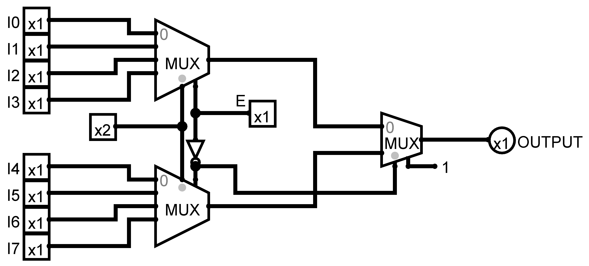

# Logical Circuits (Logisim)

Logical circuits created using [Logisim](http://www.cburch.com/logisim)

## Index

- [MUX 8x1 Using Two 4x1 MUX](#mux-8x1-using-two-4x1-mux)
- [Parity Generator and Checker](#parity-generator-and-checker)
  - [Even Parity Generator and Checker](#even-parity-generator-and-checker)
    - [3 Bits](#3-bits)
    - [5 Bits](#5-bits)
      - [Using Circuit Analyzer](#using-circuit-analyzer)
        - [Only NAND](#only-nand)
        - [Non-only NAND](#non-only-nand)
      - [Without using Circuit Analyzer](#without-circuit-analyzer)

## [MUX 8x1 Using Two 4x1 MUX](./MUX-8-to-1-using-two-4-to-1-MUX.circ)

## Parity Generator and Checker

### Even Parity Generator and Checker

#### [3 Bits](./Parity%20Generator/Even%20Parity/3-Bits/circuit.circ)

#### [5 Bits](./Parity%20Generator/Even%20Parity/5-Bits)

The above image is the base circuit for all 5 bit even parity generator and checker. In which the `Sender` circuit is the `Generator or Sender` circuit and `Reciver` circuit is the `Checker or Receiver` circuit.

#### [Without using Circuit Analyzer](./Parity%20Generator/Even%20Parity/5-Bits/Without%20using%20Circuit%20Analyzer)

#### [Using Circuit Analyzer](./Parity%20Generator/Even%20Parity/5-Bits/Using%20Circuit%20Analyzer)

*Circuit Analyzer* is a feature of logisim which generates circuit based on the given number of input and outputs.

#### [Only NAND](./Parity%20Generator/Even%20Parity/5-Bits/Using%20Circuit%20Analyzer/Only%20NAND)

[Generator *(or Sender)*](./Parity%20Generator/Even%20Parity/5-Bits/Using%20Circuit%20Analyzer/Only%20NAND/circuit.circ)

[Checker *(or Receiver)*](./Parity%20Generator/Even%20Parity/5-Bits/Using%20Circuit%20Analyzer/Only%20NAND/circuit.circ)

#### [Non-only NAND](./Parity%20Generator/Even%20Parity/5-Bits/Using%20Circuit%20Analyzer/Non-only%20NAND)

[Generator *(or Sender)*](./Parity%20Generator/Even%20Parity/5-Bits/Using%20Circuit%20Analyzer/Non-only%20NAND/circuit.circ)

[Checker *(or Receiver)*](./Parity%20Generator/Even%20Parity/5-Bits/Using%20Circuit%20Analyzer/Non-only%20NAND/circuit.circ)

