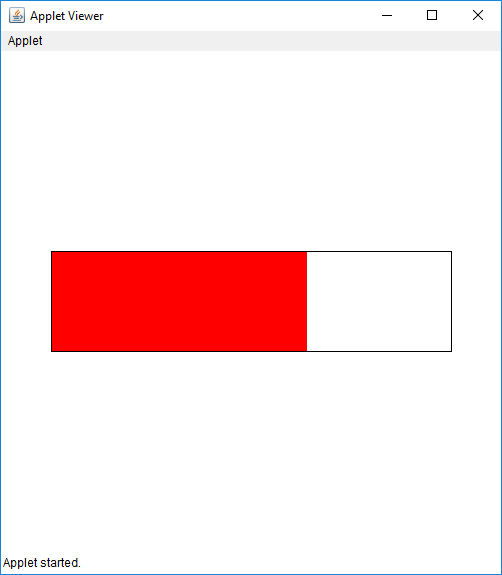
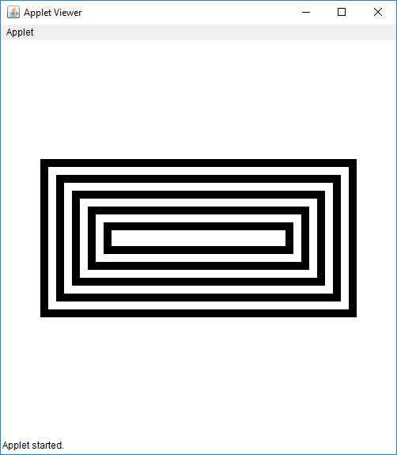
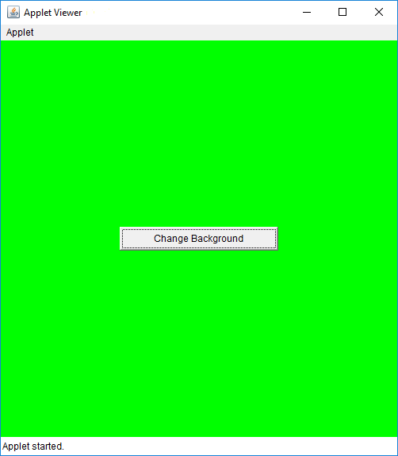
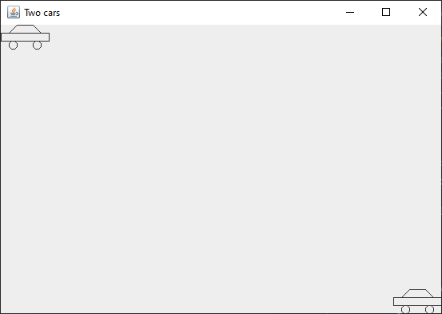
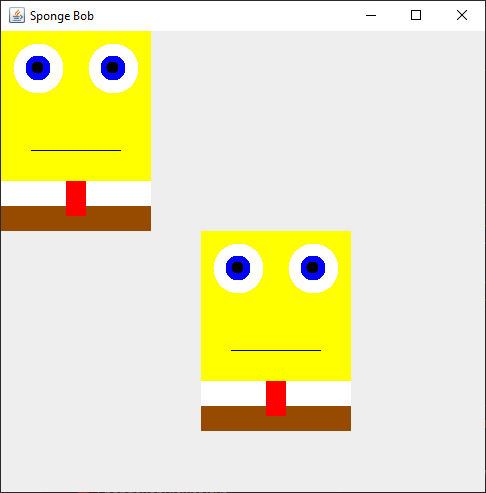

# Graphical User Interface Programs

- [Applet Programs](#applet-programs)
  - [Centered Text](#centered-text)
  - [Animated Rectangle Filling](#animated-rectangle-filling)
  - [Rectangles Inside Rectangle](#rectangles-inside-rectangle)
  - [Background Color Change](#background-color-change)
- [Swing](#swing)
  - [Two Cars](#two-cars)
  - [SpongeBob](#spongebob)

## Applet Programs

### Centered Text

```Java
/*<applet code="Main.class" width="500" height="500"></applet>*/

public class Main extends Applet {
   public void paint(Graphics g) {
      Dimension as = this.getSize();
      String str = "Some long test string";
      int w = 200;
      int h = 200;
      int OvalX = (as.width / 2) - (w / 2);
      int OvalY = (as.height / 2) - (h / 2);
      g.drawOval(OvalX, OvalY, w, h);
      w = g.getFontMetrics().stringWidth(str);
      int StringX = (as.width / 2) - (w / 2);
      int StringY = (as.height / 2);
      g.drawString(str, StringX, StringY);
   }
}
```

### Animated Rectangle Filling

```Java
/*<applet code="Main.class" width="500" height="500"></applet>*/

public class Main extends Applet {
   public void paint(Graphics g) {
      Dimension as = this.getSize();
      int w = 400;
      int h = 100;
      int x = (as.width / 2) - (w / 2);
      int y = (as.height / 2) - (h / 2);
      g.drawRect(x, y, w, h);
      int filledW = 5;
      g.setColor(Color.red);
      x++;
      y++;
      w--;
      h--;
      while (filledW <= w) {
         try {
            g.fillRect(x, y, filledW, h);
            filledW += 5;
            Thread.sleep(100);
         } catch (Exception e) {
            showStatus("" + e);
         }
      }
   }
}
```



### Rectangles Inside Rectangle

```Java
/*<applet code="Main" width="500" height="500"></applet>*/

public class Main extends Applet {
   public void paint(Graphics g) {
      Dimension as = this.getSize();
      int w = 400;
      int h = 200;
      int x = (as.width / 2) - (w / 2);
      int y = (as.height / 2) - (h / 2);
      for (int i = 0; i < 10; i++) {
         if (i % 2 == 0) {
            g.setColor(Color.black);
         } else {
            g.setColor(Color.white);
         }
         g.fillRect(x, y, w, h);
         x += 10;
         y += 10;
         w -= 20;
         h -= 20;
      }
   }
}
```



### Background Color Change

Write a program that has only one button in the frame, clicking on the button cycles through the colors: red->green->blue-> and so on.one color change per click.

```Java
/*<applet code="Main.class" width="500" height="500"></applet>*/

public class Main extends Applet implements ActionListener {
   Button button;

   public void init() {
      Dimension as = this.getSize();
      int w = 200;
      int h = 30;
      int x = (as.width / 2) - (w / 2);
      int y = (as.height / 2) - (h / 2);
      setLayout(null);
      button = new Button("Change Background");
      button.setBounds(x, y, w, h);
      button.addActionListener(this);
      add(button);
      setBackground(Color.red);
   }

   public void actionPerformed(ActionEvent e) {
      Color bgColor = getBackground();
      if (bgColor.equals(Color.red)) {
         setBackground(Color.green);
      } else if (bgColor.equals(Color.green)) {
         setBackground(Color.blue);
      } else if (bgColor.equals(Color.blue)) {
         setBackground(Color.red);
      }
   }
}
```



## Swing

### Two Cars



There are total 3 classes. One for defining the look of a car [`Car`], another one for the number of cars and their intital position [`CarComponent`], and the last one [`CarViewer`] is act as a container for cars; and is displayed on the screen.

```Java
class Car {
    private int xLeft;
    private int yTop;

    /**
     * Constructs a car with a given top left corner.
     * 
     * @param x the x coordinate of the top left corner
     * @param y the y coordinate of the top left corner
     */
    public Car(int x, int y) {
        xLeft = x;
        yTop = y;
    }

    /**
     * Draws the car.
     * 
     * @param g2 the graphics context
     */
    public void draw(Graphics2D g2) {
        Rectangle body = new Rectangle(xLeft, yTop + 10, 60, 10);
        Ellipse2D.Double frontTire = new Ellipse2D.Double(xLeft + 10, yTop + 20, 10, 10);
        Ellipse2D.Double rearTire = new Ellipse2D.Double(xLeft + 40, yTop + 20, 10, 10);

        // The bottom of the front windshield
        Point2D.Double r1 = new Point2D.Double(xLeft + 10, yTop + 10);
        // The front of the roof
        Point2D.Double r2 = new Point2D.Double(xLeft + 20, yTop);
        // The rear of the roof
        Point2D.Double r3 = new Point2D.Double(xLeft + 40, yTop);
        // The bottom of the rear windshield
        Point2D.Double r4 = new Point2D.Double(xLeft + 50, yTop + 10);

        Line2D.Double frontWindshield = new Line2D.Double(r1, r2);
        Line2D.Double roofTop = new Line2D.Double(r2, r3);
        Line2D.Double rearWindshield = new Line2D.Double(r3, r4);

        g2.draw(body);
        g2.draw(frontTire);
        g2.draw(rearTire);
        g2.draw(frontWindshield);
        g2.draw(roofTop);
        g2.draw(rearWindshield);
    }
}

/**
 * This component draws two car shapes.
 */
class CarComponent extends JComponent {
    private static final long serialVersionUID = 1L;

    public void paintComponent(Graphics g) {
        Graphics2D g2 = (Graphics2D) g;

        Car car1 = new Car(0, 0);

        int x = getWidth() - 60;
        int y = getHeight() - 30;

        Car car2 = new Car(x, y);

        car1.draw(g2);
        car2.draw(g2);
    }
}

public class CarViewer {
    public static void main(String[] args) {
        JFrame frame = new JFrame();

        frame.setSize(300, 400);
        frame.setTitle("Two cars");
        frame.setDefaultCloseOperation(JFrame.EXIT_ON_CLOSE);

        CarComponent component = new CarComponent();
        frame.add(component);

        frame.setVisible(true);
    }
}
```

### SpongeBob



There are total 3 classes. One for defining the look of a spongebob [`SpongeBob`], another one for the number of spongebob and their intital position [`SpongeBobComponent`], and the last one [`SpongeBobViewer`] is act as a container for cars; and is displayed on the screen.

SpongeBob.java

```Java
public class SpongeBob {
    private int xLeft;
    private int yTop;
    private final static int DRAWING_WIDTH = 150;
    private final static int SIZE_FACE_HEIGHT = 150;
    private final static int SIZE_FACE_WIDTH = DRAWING_WIDTH;
    private final static int SIZE_EYE_HEIGHT = 50;
    private final static int SIZE_EYE_WIDTH = SIZE_EYE_HEIGHT;
    private final static int SIZE_EYE_IRIS_HEIGHT = (SIZE_EYE_HEIGHT / 2);
    private final static int SIZE_EYE_IRIS_WIDTH = SIZE_EYE_IRIS_HEIGHT;
    private final static int SIZE_EYE_IRIS_PUPIL_HEIGHT = (SIZE_EYE_IRIS_WIDTH / 2);
    private final static int SIZE_EYE_IRIS_PUPIL_WIDTH = SIZE_EYE_IRIS_PUPIL_HEIGHT;
    private final static int SIZE_SHIRT_HEIGHT = 25;
    private final static int SIZE_SHIRT_WIDTH = DRAWING_WIDTH;
    private final static int SIZE_TIE_HEIGHT = (SIZE_SHIRT_HEIGHT + 10);
    private final static int SIZE_TIE_WIDTH = 20;
    private final static int SIZE_PANT_HEIGHT = SIZE_SHIRT_HEIGHT;
    private final static int SIZE_PANT_WIDTH = DRAWING_WIDTH;
    private final static double PERCENTAGE_20 = 0.2f;
    private final static int MARGIN_UPPER_LIP_FROM_BOTTOM = (int) (SIZE_FACE_HEIGHT
            - (SIZE_FACE_HEIGHT * PERCENTAGE_20));
    private final static int DRAWING_HEIGHT = (SIZE_FACE_HEIGHT + SIZE_SHIRT_HEIGHT + SIZE_PANT_HEIGHT);

    private static Color brown;

    public SpongeBob(int x, int y) {
        xLeft = x;
        yTop = y;
        brown = new Color(150, 75, 0);
    }

    public static int getDrawingWidth() {
        return DRAWING_WIDTH;
    }

    public static int getDrawingHeight() {
        return DRAWING_HEIGHT;
    }

    public void draw(Graphics2D g2) {
        final int FACE_POSITION_X = xLeft;
        final int FACE_POSITION_Y = yTop;
        Rectangle face = new Rectangle(FACE_POSITION_X, FACE_POSITION_Y, SIZE_FACE_WIDTH, SIZE_FACE_HEIGHT);
        g2.setPaint(Color.YELLOW);
        g2.fill(face);

        /* Left Eye Start */
        // 1 defines the 1/4 th part of the face
        final int LEFT_EYE_POSITION_X = FACE_POSITION_X + ((1 * SIZE_FACE_WIDTH) / 4) - (SIZE_EYE_WIDTH / 2);
        final int LEFT_EYE_POSITION_Y = (FACE_POSITION_Y + SIZE_FACE_HEIGHT / 4) - (SIZE_EYE_HEIGHT / 2);
        Ellipse2D.Double leftEye = new Ellipse2D.Double(LEFT_EYE_POSITION_X, LEFT_EYE_POSITION_Y,
                SIZE_EYE_HEIGHT, SIZE_EYE_WIDTH);
        g2.setPaint(Color.WHITE);
        g2.fill(leftEye);

        final int LEFT_EYE_IRIS_POSITION_X = LEFT_EYE_POSITION_X + (SIZE_EYE_IRIS_WIDTH / 2);
        final int LEFT_EYE_IRIS_POSITION_Y = LEFT_EYE_POSITION_Y + (SIZE_EYE_IRIS_HEIGHT / 2);
        Ellipse2D.Double leftEyeIris = new Ellipse2D.Double(LEFT_EYE_IRIS_POSITION_X, LEFT_EYE_IRIS_POSITION_Y,
                SIZE_EYE_IRIS_HEIGHT, SIZE_EYE_IRIS_WIDTH);
        g2.setPaint(Color.BLUE);
        g2.fill(leftEyeIris);

        final int LEFT_EYE_IRIS_PUPIL_POSITION_X = LEFT_EYE_IRIS_POSITION_X + (SIZE_EYE_IRIS_PUPIL_WIDTH / 2);
        final int LEFT_EYE_IRIS_PUPIL_POSITION_Y = LEFT_EYE_IRIS_POSITION_Y + (SIZE_EYE_IRIS_PUPIL_HEIGHT / 2);
        Ellipse2D.Double leftEyeIrisPupil = new Ellipse2D.Double(LEFT_EYE_IRIS_PUPIL_POSITION_X,
                LEFT_EYE_IRIS_PUPIL_POSITION_Y, SIZE_EYE_IRIS_PUPIL_HEIGHT, SIZE_EYE_IRIS_PUPIL_WIDTH);
        g2.setPaint(Color.BLACK);
        g2.fill(leftEyeIrisPupil);
        /* Left Eye End */

        /* Right Eye Start */

        // 3 is defines the 3/4 th of the face
        final int RIGHT_EYE_POSITION_X = FACE_POSITION_X + ((3 * SIZE_FACE_WIDTH) / 4) - (SIZE_EYE_WIDTH / 2);
        final int RIGHT_EYE_POSITION_Y = LEFT_EYE_POSITION_Y;
        Ellipse2D.Double rightEye = new Ellipse2D.Double(RIGHT_EYE_POSITION_X, RIGHT_EYE_POSITION_Y,
                SIZE_EYE_HEIGHT, SIZE_EYE_WIDTH);
        g2.setPaint(Color.WHITE);
        g2.fill(rightEye);

        final int RIGHT_EYE_IRIS_POSITION_X = RIGHT_EYE_POSITION_X + (SIZE_EYE_IRIS_WIDTH / 2);
        final int RIGHT_EYE_IRIS_POSITION_Y = LEFT_EYE_IRIS_POSITION_Y;
        Ellipse2D.Double rightEyeIris = new Ellipse2D.Double(RIGHT_EYE_IRIS_POSITION_X,
                RIGHT_EYE_IRIS_POSITION_Y, SIZE_EYE_IRIS_HEIGHT, SIZE_EYE_IRIS_WIDTH);
        g2.setPaint(Color.BLUE);
        g2.fill(rightEyeIris);

        final int RIGHT_EYE_IRIS_PUPIL_POSITION_X = RIGHT_EYE_IRIS_POSITION_X + (SIZE_EYE_IRIS_PUPIL_WIDTH / 2);
        final int RIGHT_EYE_IRIS_PUPIL_POSITION_Y = LEFT_EYE_IRIS_PUPIL_POSITION_Y;
        Ellipse2D.Double rightEyeIrisPupil = new Ellipse2D.Double(RIGHT_EYE_IRIS_PUPIL_POSITION_X,
                RIGHT_EYE_IRIS_PUPIL_POSITION_Y, SIZE_EYE_IRIS_PUPIL_HEIGHT, SIZE_EYE_IRIS_PUPIL_WIDTH);
        g2.setPaint(Color.BLACK);
        g2.fill(rightEyeIrisPupil);
        /* Right Eye End */

        final int UPPER_LIP_STARTING_POISTION_X = FACE_POSITION_X + (int) (SIZE_FACE_WIDTH * PERCENTAGE_20);
        final int UPPER_LIP_STARTING_POISTION_Y = FACE_POSITION_Y + MARGIN_UPPER_LIP_FROM_BOTTOM;
        final int UPPER_LIP_ENDING_POISTION_X = (int) ((FACE_POSITION_X + SIZE_FACE_WIDTH)
                - (SIZE_FACE_WIDTH * PERCENTAGE_20));
        final int UPPER_LIP_ENDING_POISTION_Y = UPPER_LIP_STARTING_POISTION_Y;
        Line2D.Double upperLip = new Line2D.Double(UPPER_LIP_STARTING_POISTION_X, UPPER_LIP_STARTING_POISTION_Y,
                UPPER_LIP_ENDING_POISTION_X, UPPER_LIP_ENDING_POISTION_Y);
        g2.setPaint(Color.BLACK);
        g2.draw(upperLip);

        final int SHIRT_POSITION_X = FACE_POSITION_X;
        final int SHIRT_POSITION_Y = FACE_POSITION_Y + SIZE_FACE_HEIGHT;
        Rectangle shirt = new Rectangle(SHIRT_POSITION_X, SHIRT_POSITION_Y, SIZE_SHIRT_WIDTH,
                SIZE_SHIRT_HEIGHT);
        g2.setPaint(Color.WHITE);
        g2.fill(shirt);

        final int PANT_POSITION_X = SHIRT_POSITION_X;
        final int PANT_POSITION_Y = SHIRT_POSITION_Y + SIZE_PANT_HEIGHT;
        Rectangle pant = new Rectangle(PANT_POSITION_X, PANT_POSITION_Y, SIZE_PANT_WIDTH, SIZE_PANT_HEIGHT);
        g2.setPaint(brown);
        g2.fill(pant);

        final int TIE_POSITION_X = SHIRT_POSITION_X + ((SIZE_SHIRT_WIDTH - SIZE_TIE_WIDTH) / 2);
        final int TIE_POSITION_Y = SHIRT_POSITION_Y;
        Rectangle tie = new Rectangle(TIE_POSITION_X, TIE_POSITION_Y, SIZE_TIE_WIDTH, SIZE_TIE_HEIGHT);
        g2.setPaint(Color.RED);
        g2.fill(tie);
    }
}
```

SpongeBobComponent.java

```Java
class SpongeBobComponent extends JComponent {
    final static int POSITION_X = 0;
    final static int POSITION_Y = 0;

    public void paintComponent(Graphics g) {
        Graphics2D g2 = (Graphics2D) g;
        
        SpongeBob drawing1 = new SpongeBob(POSITION_X, POSITION_Y);
        drawing1.draw(g2);

        SpongeBob drawing2 = new SpongeBob(200, 200);
        drawing2.draw(g2);
    }
}
```

SpongeBobViewer.java

```Java
public class SpongeBobViewer {
    final static int FRAME_SIZE_WIDTH = 500;
    final static int FRAME_SIZE_HEIGHT = 500;

    public static void main(String[] args) {
        JFrame frame = new JFrame();
        frame.setSize(FRAME_SIZE_WIDTH, FRAME_SIZE_HEIGHT);
        frame.setTitle("Sponge Bob");
        frame.setDefaultCloseOperation(JFrame.EXIT_ON_CLOSE);

        SpongeBobComponent component = new SpongeBobComponent();
        frame.add(component);

        frame.setVisible(true);
    }
}
```
